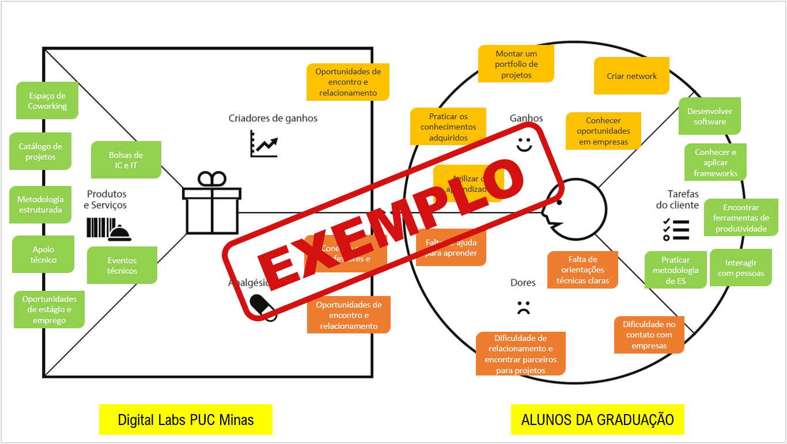
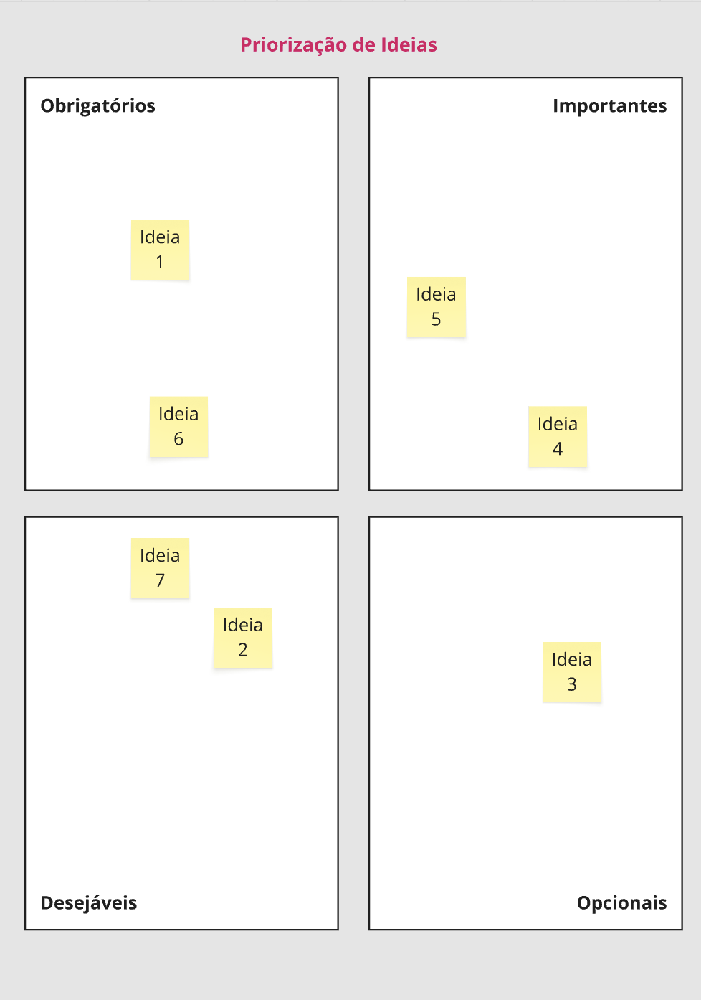
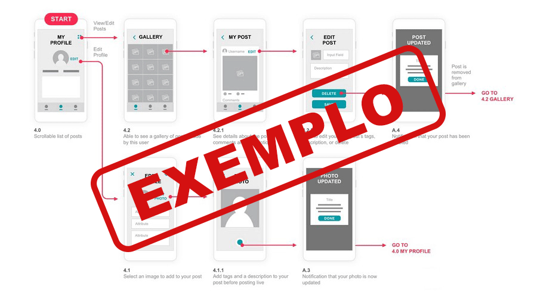
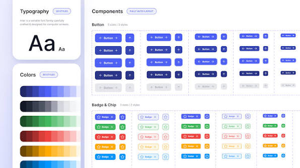
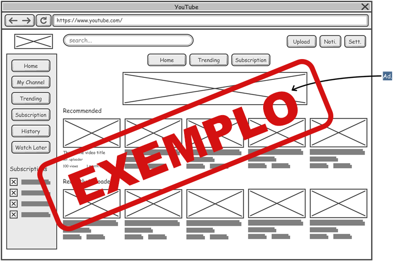

[⬅ Voltar ao índice](../README.md)

# Product Design

Nesse momento, vamos transformar os insights e validações obtidos em soluções tangíveis e utilizáveis. Essa fase envolve a definição de uma proposta de valor, detalhando a prioridade de cada ideia e a consequente criação de wireframes, mockups e protótipos de alta fidelidade, que detalham a interface e a experiência do usuário.

## Proposta de Valor

**✳️✳️✳️ APRESENTE O DIAGRAMA DA PROPOSTA DE VALOR PARA CADA PERSONA ✳️✳️✳️**

##### Proposta para Persona XPTO ⚠️ EXEMPLO ⚠️

> ⚠️ **APAGUE ESSA PARTE ANTES DE ENTREGAR SEU TRABALHO**
>
> O mapa da proposta de valor é uma ferramenta que nos ajuda a definir qual tipo de produto ou serviço melhor atende às personas definidas anteriormente.

## Requisitos

_Esta seção descreve os requisitos comtemplados nesta descrição arquitetural, divididos em dois grupos: funcionais e não funcionais._

### Requisitos Funcionais

_Enumere os requisitos funcionais previstos para a sua aplicação. Concentre-se nos requisitos funcionais que sejam críticos para a definição arquitetural. Lembre-se de listar todos os requisitos que são necessários para garantir cobertura arquitetural. Esta seção deve conter uma lista de requisitos ainda sem modelagem. Na coluna Prioridade utilize uma escala (do mais prioritário para o menos): Essencial, Desejável, Opcional._

| **ID** | **Descrição** | **Prioridade** |
| ------ | ------------- | -------------- |
| RF001  |               |                |
| RF002  |               |                |
| RF003  |               |                |
|        |               |                |
|        |               |                |

Obs: acrescente mais linhas, se necessário.

### Requisitos Não-Funcionais

_Enumere os requisitos não-funcionais previstos para a sua aplicação. Entre os requisitos não funcionais, inclua todos os requisitos que julgar importante do ponto de vista arquitetural ou seja os requisitos que terão impacto na definição da arquitetura. Os requisitos devem ser descritos de forma completa e preferencialmente quantitativa._

| **ID** | **Descrição** |
| ------ | ------------- |
| RNF001 |               |
| RNF002 |               |
|        |               |
|        |               |
|        |               |

Obs: acrescente mais linhas, se necessário.

> ⚠️ **APAGUE ESSA PARTE ANTES DE ENTREGAR SEU TRABALHO**
> Apresente os requisitos funcionais (o que o sistema deve fazer) e os requisitos não funcionais (como o sistema deve se comportar e suas restrições) do seu projeto. Lembre-se de que você deve enumerar, descrever claramente e definir a prioridade (ex: Alta, Média, Baixa) de todos os requisitos que a solução almeja atender, utilizando identificadores únicos (como RF-01, RNF-01).

> **Orientações e Referências**:
>
> - [Engenharia de Software Moderna - Cap. 3: Engenharia de Requisitos (Marco Tulio Valente)](https://engsoftmoderna.info/cap3.html)
> - [Glossário de Engenharia de Requisitos (IREB - International Requirements Engineering Board)](https://cpre.ireb.org/en/downloads-and-resources/glossary?first-letter=R)
> - [Guia SWEBOK - Software Engineering Body of Knowledge (IEEE Computer Society)](https://www.computer.org/education/bodies-of-knowledge/software-engineering#about)

## Priorização de Requisitos

## Projeto de Interface

Artefatos relacionados com a interface e a interacão do usuário na proposta de solução.

### User Flow

**✳️✳️✳️ COLOQUE AQUI O DIAGRAMA DE FLUXO DE TELAS ✳️✳️✳️**

> ⚠️ **APAGUE ESSA PARTE ANTES DE ENTREGAR SEU TRABALHO**
>
> Fluxo de usuário (User Flow) é uma técnica que permite ao desenvolvedor mapear todo fluxo de telas do site ou app. Essa técnica funciona para alinhar os caminhos e as possíveis ações que o usuário pode fazer junto com os membros de sua equipe.
>
> **Orientações**:
>
> - [User Flow: O Quê É e Como Fazer?](https://medium.com/7bits/fluxo-de-usu%C3%A1rio-user-flow-o-que-%C3%A9-como-fazer-79d965872534)
> - [User Flow vs Site Maps](http://designr.com.br/sitemap-e-user-flow-quais-as-diferencas-e-quando-usar-cada-um/)
> - [Top 25 User Flow Tools &amp; Templates for Smooth](https://www.mockplus.com/blog/post/user-flow-tools)

### Design System

**✳️✳️✳️ COLOQUE AQUI OS ELEMENTOS DE DESIGN SYSTEM ✳️✳️✳️**

> ⚠️ **APAGUE ESSA PARTE ANTES DE ENTREGAR SEU TRABALHO**
> Descreva e documente o Design System do seu projeto. Um Design System é um conjunto de padrões, diretrizes e componentes visuais reutilizáveis (como paletas de cores, tipografia, ícones, espaçamentos e botões) que servem como a base unificada para a construção da interface da aplicação. Ele garante que o produto tenha consistência visual, facilitando a navegação do usuário e o desenvolvimento.
> **Orientações e Referências**:
>
> - [Design Systems 101 (Nielsen Norman Group)](https://www.google.com/search?q=https://www.nngroup.com/articles/design-systems-101/&utm_source=gemini) - _Definição conceitual pela maior autoridade global em usabilidade._
> - [Material Design (Google)](https://www.google.com/search?q=https://m3.material.io/&utm_source=gemini) - _Excelente referência prática e documentação de componentes._
> - [Human Interface Guidelines (Apple)](https://www.google.com/search?q=https://developer.apple.com/design/human-interface-guidelines/&utm_source=gemini) - _Padrões oficiais de design e interação para o ecossistema Apple._
> - [Carbon Design System (IBM)](https://www.google.com/search?q=https://carbondesignsystem.com/&utm_source=gemini) - _Exemplo robusto de um Design System corporativo de código aberto para consulta._

### Wireframes

Estes são os protótipos de telas do sistema.

**✳️✳️✳️ COLOQUE AQUI OS PROTÓTIPOS DE TELAS COM TÍTULO E DESCRIÇÃO ✳️✳️✳️**

##### TELA XPTO ⚠️ EXEMPLO ⚠️

Descrição para a tela XPTO

> ⚠️ **APAGUE ESSA PARTE ANTES DE ENTREGAR SEU TRABALHO**
>
> Wireframes são protótipos das telas da aplicação usados em design de interface para sugerir a estrutura de um site web e seu relacionamentos entre suas páginas. Um wireframe web é uma ilustração semelhante ao layout de elementos fundamentais na interface.
>
> **Orientações**:
>
> - [Ferramentas de Wireframes](https://rockcontent.com/blog/wireframes/)
> - [Figma](https://www.figma.com/)
> - [Adobe XD](https://www.adobe.com/br/products/xd.html#scroll)
> - [MarvelApp](https://marvelapp.com/developers/documentation/tutorials/)

### Protótipo Interativo

**✳️✳️✳️ COLOQUE AQUI UM IFRAME COM SEU PROTÓTIPO INTERATIVO ✳️✳️✳️**

✅ [Protótipo Interativo (MarvelApp)](https://marvelapp.com/prototype/4hd6091?emb=1&iosapp=false&frameless=false) ⚠️ EXEMPLO ⚠️

> ⚠️ **APAGUE ESSA PARTE ANTES DE ENTREGAR SEU TRABALHO**
>
> Um protótipo interativo apresenta o projeto de interfaces e permite ao usuário navegar pelas funcionalidades como se estivesse lidando com o software pronto. Utilize as mesmas ferramentas de construção de wireframes para montagem do seu protótipo interativo. Inclua o link para o protótipo interativo do projeto.

---

[⬅ Anterior: Product Discovery](2_product-discovery.md) | [⬅ Voltar ao índice](../README.md) | [Próximo: Minimundo ➡](4_minimundo.md)
